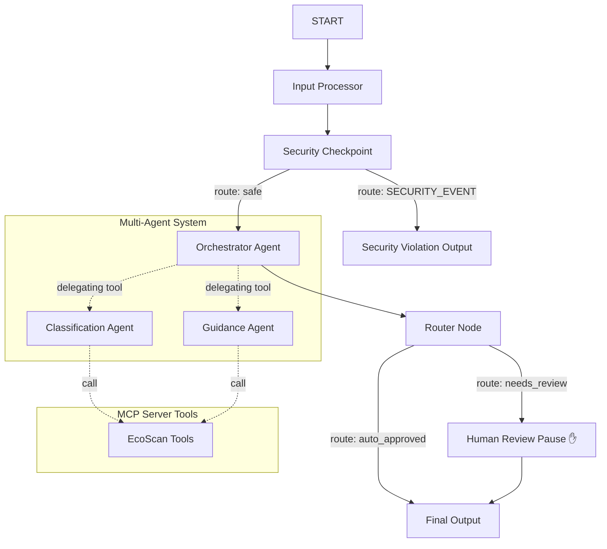

# 🌍 EcoScan Agent — Submission Write-Up

## Problem Statement
Improper disposal of waste, especially electronics, batteries, and hazardous household chemicals, is a major driver of environmental contamination. Consumers want to recycle correctly but find municipal rules highly complex, fragmented by location, and difficult to parse. EcoScan provides an intuitive, context-aware, and secure waste disposal assistant that categorizes items and cross-references them with hyper-local guidelines.

---

## Solution Architecture

EcoScan utilizes a robust multi-agent architecture combined with safety filters and external tool execution.

---

## Core Concepts & Implementation

1. **ADK 2.0 Workflow Graph** ([app/agent.py](file:///c:/Users/Pragati%20Singh/OneDrive/Documents/AIAGENT/adk.workshop/ecoscan-agent/app/agent.py))
   - Implements a programmatic state machine using node functions, conditional edges, and context-based routing.
   - Manages state variables (like `item_description`, `user_location`, `needs_review`) inside `ctx.state` to coordinate multi-node data flow.

2. **LlmAgents & Agent Tools** ([app/agent.py](file:///c:/Users/Pragati%20Singh/OneDrive/Documents/AIAGENT/adk.workshop/ecoscan-agent/app/agent.py))
   - **`orchestrator`**: Coordinates the entire evaluation flow, delegates work to specialized agents, and determines whether human-in-the-loop validation is needed.
   - **`classification_agent`**: Tailored to parse physical materials and assess general hazard tiers.
   - **`guidance_agent`**: Focused solely on locating regional facilities and parsing municipal disposal rules.
   - Leverages `AgentTool` to dynamically spawn and communicate with sub-agents using natural language.

3. **MCP Server** ([app/mcp_server.py](file:///c:/Users/Pragati%20Singh/OneDrive/Documents/AIAGENT/adk.workshop/ecoscan-agent/app/mcp_server.py))
   - Extends the model's environment with FastMCP tools communicating over standard input/output (stdio).
   - Exposes three key domain-specific tools:
     - `identify_hazardous_materials`: Checks item descriptions against known chemical, battery, and hazardous profiles.
     - `get_local_recycling_rules`: Fetches specialized collection bin guidelines matching locations.
     - `lookup_dropoff_locations`: Retrieves facility names and schedules.
   - Wireframe: Integrated into the sub-agents using `McpToolset`.

4. **Security Checkpoint** ([app/agent.py](file:///c:/Users/Pragati%20Singh/OneDrive/Documents/AIAGENT/adk.workshop/ecoscan-agent/app/agent.py))
   - Sits immediately after input ingestion to run safety checks before passing any prompts to the LLMs.
   - Features:
     - PII Scrubbing: Automatically replaces phone numbers and emails with redaction placeholders.
     - Injection Detection: Screens input for override commands (`"ignore instructions"`, `"jailbreak"`, etc.).
     - Illegal dumping detector: Rejects inputs expressing explicit intent to dump waste illegally (e.g. `"pour down drain"`, `"dump in river"`).
     - Audit Logging: Outputs structured JSON metrics with severity levels (`INFO`, `WARNING`, `CRITICAL`).

5. **Human-in-the-Loop Flow (HITL)** ([app/agent.py](file:///c:/Users/Pragati%20Singh/OneDrive/Documents/AIAGENT/adk.workshop/ecoscan-agent/app/agent.py))
   - Workflow pauses with `RequestInput` if the orchestrator detects a hazardous material (e.g. batteries, mercury, chemical solvents) or flags an ambiguous item.
   - Requires an operator to explicitly type `yes` or `no` to approve the disposal instruction before saving the audit status to the final output report.

---

## Value and Impact
By bridging the gap between raw LLM capabilities and secure, localized data lookups, EcoScan prevents public confusion, reduces unsafe chemical disposal, and limits contamination rates in standard recycling pipelines.
